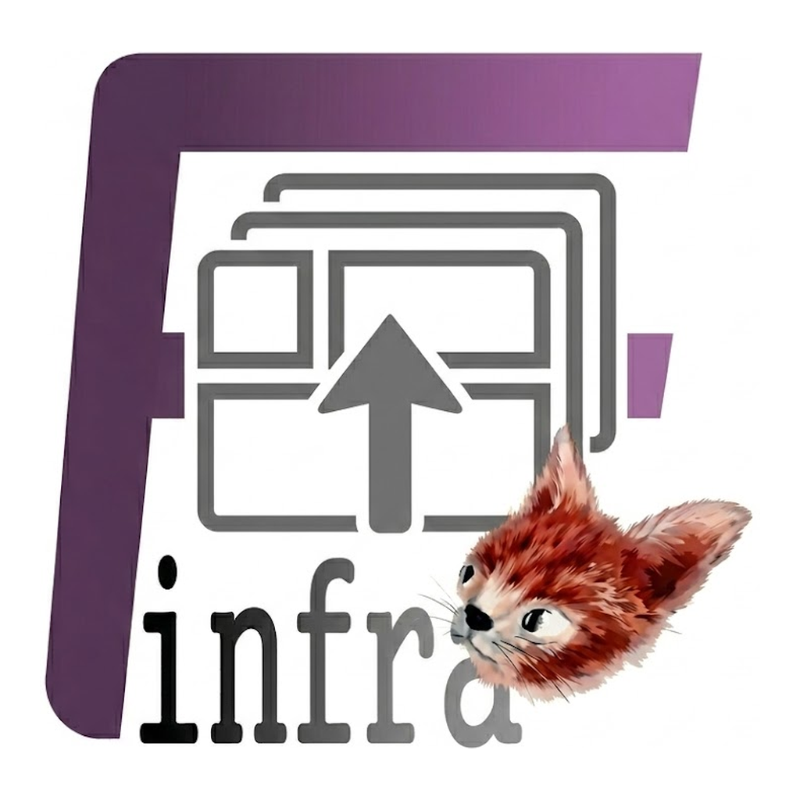

[](./README_kr.md)

 [EN](https://finfra.kr/product/fWarrange/en/index.html) | [KR](https://finfra.kr/product/fWarrange/kr/index.html)

> **The Ultimate Mac Window Management, Easy Layout Restoration.**

macOS Window Management & Layout Tool. Save and restore window positions and sizes with a single shortcut. Perfect for multi-display workflows.

# Editions

| Edition | Interface | Price | Install | Source |
| ------- | --------- | ----- | ------- | ------ |
| **fWarrange** (GUI) | Full GUI with menu bar | Paid (App Store) | [App Store](https://finfra.kr/product/fWarrange/en/index.html) | Closed |
| **fWarrangeCli** (CLI) | Menu bar + REST API | **Free & Open Source** | `brew install finfra/tap/fwarrange-cli` | [`cli/`](./cli/) |

This repository serves as:
* **User support & documentation** for the paid GUI version (App Store)
* **Source code repository** for the free CLI version (open source)

# Features

* **Shortcut Restore** - Instantly restore saved layouts with hotkeys
* **Easy Save** - One-click save of current window positions and sizes
* **Minimal Interface** - Runs quietly from the menu bar
* **Multi-Display Support** - Remembers layouts across multiple monitors
* **Multiple Workspaces** - Save different layouts for different tasks
* **Detailed Restoration** - Fine-grained control over app placement
* **Lightning-Fast Switching** - Keyboard-only workflow switching

# CLI Quick Start

```bash
# Install via Homebrew
brew install finfra/tap/fwarrange-cli

# Or build from source
cd cli && xcodebuild -scheme fWarrangeCli -configuration Release build -quiet
```

# Requirements

* macOS 14.0 or later

# Product Page

| Language | Link                                                                          |
| -------- | ----------------------------------------------------------------------------- |
| English  | [fWarrange - Product Page](https://finfra.kr/product/fWarrange/en/index.html) |
| Korean   | [fWarrange - 제품 페이지](https://finfra.kr/product/fWarrange/kr/index.html)  |

# Other Finfra Products

## Service
| Product                        | Description                                     | Link                                                                                                                                  |
| ------------------------------ | ----------------------------------------------- | ------------------------------------------------------------------------------------------------------------------------------------- |
| Local LLM Agent Coding Support | AI Agent development system & engineer training | [EN](https://finfra.kr/product/LocalLLMAgentCoding/en/index.html) / [KR](https://finfra.kr/product/LocalLLMAgentCoding/kr/index.html) |
| Mac App Development            | macOS app development, consulting & training    | [EN](https://finfra.kr/product/MacAppDev/en/index.html) / [KR](https://finfra.kr/product/MacAppDev/kr/index.html)                     |

## Mac OS App
| Product      | Description                                    | Link                                                                                                                    |
| ------------ | ---------------------------------------------- | ----------------------------------------------------------------------------------------------------------------------- |
| fSnippet     | Powerful text expansion & snippet tool         | [EN](https://finfra.kr/product/fSnippet/en/index.html) / [KR](https://finfra.kr/product/fSnippet/kr/index.html)         |
| fBanner      | Clipboard to banner image, instantly           | [EN](https://finfra.kr/product/fBanner/en/index.html) / [KR](https://finfra.kr/product/fBanner/kr/index.html)           |
| fBoard       | Your personalized screen board                 | [EN](https://finfra.kr/product/fBoard/en/index.html) / [KR](https://finfra.kr/product/fBoard/kr/index.html)             |
| fQRGen       | Clipboard to QR code, instantly                | [EN](https://finfra.kr/product/fQRGen/en/index.html) / [KR](https://finfra.kr/product/fQRGen/kr/index.html)             |
| fGoogleSheet | The fastest Google Sheets menu bar app for Mac | [EN](https://finfra.kr/product/fGoogleSheet/en/index.html) / [KR](https://finfra.kr/product/fGoogleSheet/kr/index.html) |

# Documentation

| Document                              | Description                       |
| ------------------------------------- | --------------------------------- |
| [Manual](./manual/)                   | User manual (KR/EN)               |
| [REST API](./api/)                    | REST API reference & OpenAPI spec |
| [MCP Server](./mcp/)                  | Model Context Protocol server     |
| [Claude Code Skill](./agents/claude/) | Claude Code plugin                |
| [Localization](./localization/)       | Multi-language string resources   |

# Community & Support

## Issues
* [GitHub Issues](https://github.com/Finfra/fWarrange_public/issues)

## Board (English)
| Category | Link                                                                    |
| -------- | ----------------------------------------------------------------------- |
| Notice   | [fWarrange Notice](https://finfra.kr/w1/category/fwarrange-notice/)     |
| Guide    | [fWarrange Guide](https://finfra.kr/w1/category/fwarrange-guide/)       |
| QnA      | [fWarrange QnA](https://finfra.kr/w1/category/fwarrange-qna/)           |
| Feedback | [fWarrange Feedback](https://finfra.kr/w1/category/fwarrange-feedback/) |

## Board (Korean)
| Category | Link                                                                     |
| -------- | ------------------------------------------------------------------------ |
| Notice   | [fWarrange 공지](https://finfra.kr/w1/category/fwarrange-notice-kr/)     |
| Guide    | [fWarrange 사용법](https://finfra.kr/w1/category/fwarrange-guide-kr/)    |
| QnA      | [fWarrange QnA](https://finfra.kr/w1/category/fwarrange-qna-kr/)         |
| Feedback | [fWarrange 피드백](https://finfra.kr/w1/category/fwarrange-feedback-kr/) |

# License

Copyright (c) finfra.kr. All rights reserved.
