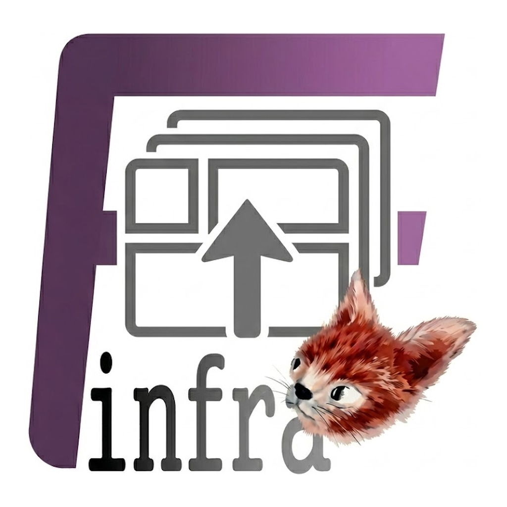

[](./README_kr.md)

 [EN](https://finfra.kr/product/fWarrange/en/index.html) | [KR](https://finfra.kr/product/fWarrange/kr/index.html)

> **The Ultimate Mac Window Management, Easy Layout Restoration.**

macOS Window Management & Layout Tool. Save and restore window positions and sizes with a single shortcut. Perfect for multi-display workflows.

# Editions

| Edition | Interface | Price | Install | Version | Source |
| ------- | --------- | ----- | ------- | ------- | ------ |
| **fWarrange** (GUI) | Full GUI with menu bar | Paid (App Store) | [App Store](https://finfra.kr/product/fWarrange/en/index.html) | Latest | Closed |
| **fWarrangeCli** (CLI) | Menu bar + REST API | **Free & Open Source** | `brew install finfra/tap/fwarrange-cli` | 1.0.2 | [`cli/`](./cli/) |

This repository serves as:
* **User support & documentation** for the paid GUI version (App Store)
* **Source code repository** for the free CLI version (open source)

# Features

* **Shortcut Restore** - Instantly restore saved layouts with hotkeys
* **Easy Save** - One-click save of current window positions and sizes
* **Auto-Capture** - Automatically save layouts on system sleep or screen lock (v1.0.2+)
* **Minimal Interface** - Runs quietly from the menu bar
* **Multi-Display Support** - Remembers layouts across multiple monitors
* **Multiple Workspaces** - Save different layouts for different tasks
* **Detailed Restoration** - Fine-grained control over app placement
* **Lightning-Fast Switching** - Keyboard-only workflow switching
* **Robust Concurrency** - Thread-safe settings and operations handling

# Installation (fWarrangeCli)

The free, open-source CLI engine is distributed via Homebrew.

```bash
# 1. Add the tap and install
brew tap finfra/tap
brew install finfra/tap/fwarrange-cli

# 2. Start the background service (auto-starts on login)
brew services start fwarrange-cli

# 3. Verify the REST API is running
curl http://localhost:3016/api/v2/status
```

## Service Management

```bash
brew services start fwarrange-cli     # Start (auto-start on login)
brew services stop fwarrange-cli      # Stop
brew services restart fwarrange-cli   # Restart
brew upgrade fwarrange-cli            # Update to the latest version
```

## Uninstall

```bash
brew services stop fwarrange-cli      # Stop the service first
brew uninstall fwarrange-cli          # Remove the app
brew untap finfra/tap                 # (optional) Remove the tap
```

> Layout data in `~/Documents/finfra/fWarrangeData/` is kept after uninstall.
> Delete that folder manually to remove all data.

> **Accessibility permission required.** On first run, grant access in
> *System Settings > Privacy & Security > Accessibility* for window control to work.

See [`cli/README.md`](./cli/README.md) for build-from-source and full details.

# Requirements

* macOS 14.0 or later

# Product Page

| Language | Link                                                                          |
| -------- | ----------------------------------------------------------------------------- |
| English  | [fWarrange - Product Page](https://finfra.kr/product/fWarrange/en/index.html) |
| Korean   | [fWarrange - 제품 페이지](https://finfra.kr/product/fWarrange/kr/index.html)  |

# Other Finfra Products

## Service
| Product                        | Description                                     | Link                                                                                                                                  |
| ------------------------------ | ----------------------------------------------- | ------------------------------------------------------------------------------------------------------------------------------------- |
| Local LLM Agent Coding Support | AI Agent development system & engineer training | [EN](https://finfra.kr/product/LocalLLMAgentCoding/en/index.html) / [KR](https://finfra.kr/product/LocalLLMAgentCoding/kr/index.html) |
| Mac App Development            | macOS app development, consulting & training    | [EN](https://finfra.kr/product/MacAppDev/en/index.html) / [KR](https://finfra.kr/product/MacAppDev/kr/index.html)                     |

## Mac OS App
| Product      | Description                                    | Link                                                                                                                    |
| ------------ | ---------------------------------------------- | ----------------------------------------------------------------------------------------------------------------------- |
| fSnippet     | Powerful text expansion & snippet tool         | [EN](https://finfra.kr/product/fSnippet/en/index.html) / [KR](https://finfra.kr/product/fSnippet/kr/index.html)         |
| fBanner      | Clipboard to banner image, instantly           | [EN](https://finfra.kr/product/fBanner/en/index.html) / [KR](https://finfra.kr/product/fBanner/kr/index.html)           |
| fBoard       | Your personalized screen board                 | [EN](https://finfra.kr/product/fBoard/en/index.html) / [KR](https://finfra.kr/product/fBoard/kr/index.html)             |
| fQRGen       | Clipboard to QR code, instantly                | [EN](https://finfra.kr/product/fQRGen/en/index.html) / [KR](https://finfra.kr/product/fQRGen/kr/index.html)             |
| fGoogleSheet | The fastest Google Sheets menu bar app for Mac | [EN](https://finfra.kr/product/fGoogleSheet/en/index.html) / [KR](https://finfra.kr/product/fGoogleSheet/kr/index.html) |

# Documentation

| Document                              | Description                       |
| ------------------------------------- | --------------------------------- |
| [Manual](./manual/)                   | User manual (KR/EN)               |
| [REST API](./api/)                    | REST API reference & OpenAPI spec |
| [MCP Server](./mcp/)                  | Model Context Protocol server     |
| [Claude Code Skill](./agents/claude/) | Claude Code plugin                |
| [Localization](./localization/)       | Multi-language string resources   |

# Community & Support

## Issues
* [GitHub Issues](https://github.com/Finfra/fWarrange_public/issues)

## Board (English)
| Category | Link                                                                    |
| -------- | ----------------------------------------------------------------------- |
| Notice   | [fWarrange Notice](https://finfra.kr/w1/category/fwarrange-notice/)     |
| Guide    | [fWarrange Guide](https://finfra.kr/w1/category/fwarrange-guide/)       |
| QnA      | [fWarrange QnA](https://finfra.kr/w1/category/fwarrange-qna/)           |
| Feedback | [fWarrange Feedback](https://finfra.kr/w1/category/fwarrange-feedback/) |

## Board (Korean)
| Category | Link                                                                     |
| -------- | ------------------------------------------------------------------------ |
| Notice   | [fWarrange 공지](https://finfra.kr/w1/category/fwarrange-notice-kr/)     |
| Guide    | [fWarrange 사용법](https://finfra.kr/w1/category/fwarrange-guide-kr/)    |
| QnA      | [fWarrange QnA](https://finfra.kr/w1/category/fwarrange-qna-kr/)         |
| Feedback | [fWarrange 피드백](https://finfra.kr/w1/category/fwarrange-feedback-kr/) |

# License

| Path                                                           | License    | Documents                             |
| :------------------------------------------------------------- | :--------- | :------------------------------------ |
| Repository (`cli/` source, docs, localization) — except `mcp/` | Apache-2.0 | [LICENSE](LICENSE) · [NOTICE](NOTICE) |
| `mcp/` (npm `fwarrange-mcp`)                                   | MIT        | [mcp/LICENSE](mcp/LICENSE)            |

The source code is open under Apache-2.0: build it and use it without limit. Three documents sit outside the code license:

* [TRADEMARK.md](TRADEMARK.md) — the names "fWarrange" / "fWarrangeCli" and the icon (Apache-2.0 §6 grants no trademark rights). Forks must be renamed
* [DISTRIBUTION-TERMS.md](DISTRIBUTION-TERMS.md) — **official builds** (Homebrew `finfra/tap`, GitHub Releases) are free for individuals, education, non-profits, open-source projects, and any organization up to **250 concurrent copies**
* [COMMERCIAL.md](COMMERCIAL.md) — more than 250 copies, resale, paid bundling, or hosted services

Korean reference translation: [LICENSE_ko.md](LICENSE_ko.md) (the English text is binding).

## License history

* `fwarrange-mcp` versions up to and including 1.0.2 published to npm were released under the MIT license and remain MIT.
* Repository contents from 2026-07-13 (after `fwarrange-mcp` 1.0.2) up to the 2026-09-27 license change were dual-licensed under CC BY-NC 4.0 or a paid commercial license. From 2026-09-27 the repository is Apache-2.0 (`mcp/`: MIT) as described above.

Copyright (c) 2026 Finfra Co., Ltd. (https://finfra.kr)
