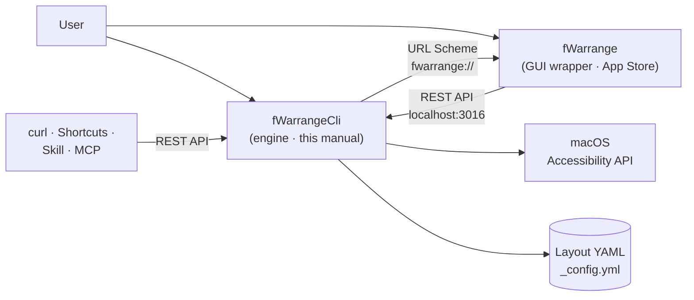

# What is fWarrangeCli?

fWarrangeCli is a **window layout engine** for macOS that saves window positions and sizes and puts them back with a single action. It lives in the menu bar and works through global shortcuts, a REST API, and a command line. It is a free, open-source (Apache-2.0) app distributed via Homebrew.

Instead of rearranging scattered windows every time on multi-monitor setups or task-specific workflows (coding, meetings, design), you restore a saved arrangement instantly.

# fWarrangeCli and fWarrange (GUI Wrapper)

> **fWarrange (a paid App Store app) is a GUI wrapper for fWarrangeCli.**
> fWarrange does not handle windows itself; it calls the fWarrangeCli REST API (`localhost:3016`) and shows a layout list, minimap, and settings window. So fWarrange does not work without fWarrangeCli, while fWarrangeCli runs all core features without fWarrange.

| Item         | fWarrangeCli (this manual)                                                                | fWarrange                                                          |
| ------------ | ----------------------------------------------------------------------------------------- | ------------------------------------------------------------------ |
| Role         | Engine (helper daemon)                                                                    | GUI wrapper                                                        |
| Distribution | Homebrew (free · open source)                                                             | App Store (paid)                                                   |
| UI           | Menu bar icon and menu                                                                    | Main window (layout list · minimap · window list) · 5-tab settings |
| Features     | Window capture/restore · YAML storage · global shortcuts · REST API · CLI · `_config.yml` | View layouts · selective restore · rename · delete · settings GUI  |
| Manual       | This document                                                                             | [fWarrange product page](https://finfra.kr/product/fWarrange/en/index.html)                                    |

**Open Main Window** and **Settings…** in the menu bar open fWarrange. If fWarrange is not installed, an App Store prompt appears.

# Key Features

| Feature           | Description                                                                        |
| ----------------- | ---------------------------------------------------------------------------------- |
| Layout capture    | Save every window's position and size to YAML via CoreGraphics + Accessibility API |
| Smart restore     | Score-based matching finds the right window even when window IDs change            |
| Multiple layouts  | Several task-specific layouts · set a default layout                               |
| Multi-display     | Works across all displays, including secondary monitors                            |
| Global shortcuts  | Save · restore default · restore last · undo (work even when inactive)             |
| Auto-save         | Automatically save the current arrangement on sleep/logout                         |
| REST API          | `localhost:3016/api/v2` — curl · Apple Shortcuts · scripts                         |
| Claude Code Skill | Manage layouts in natural language from an AI agent                                |
| MCP server        | Call as a tool from AI apps such as Claude Desktop                                 |

Window match scores: window ID 100 · exact title 90 · regex 80 · contains 70 · size/ratio/area similarity 60–30. Matches below the minimum score (default 30) are ignored.

# Four Ways to Use It

1. **Menu bar · global shortcuts** — [Menu Bar Usage](04_MenuBar_Usage.md)
2. **Command line** — `fWarrangeCli status|list|capture|restore …` ([Menu Bar Usage › Command Line](04_MenuBar_Usage.md#command-line-cli))
3. **REST API** — [REST API Usage](05_API_Usage.md)
4. **AI integration** — [Claude Code Skill](06_Skill_Usage.md) · [MCP Server](07_MCP_Usage.md)

For a GUI, install the wrapper app fWarrange as well — see the [fWarrange product page](https://finfra.kr/product/fWarrange/en/index.html).

# Data Locations

| Item        | Path                                                                      |
| ----------- | ------------------------------------------------------------------------- |
| Config file | `~/Documents/finfra/fWarrangeData/_config.yml`                            |
| Layout YAML | `~/Documents/finfra/fWarrangeData/<hostname>/*.yml` (default `host` mode) |
| Logs        | `~/Documents/finfra/fWarrangeData/logs/wlog_cliApp.log`                   |

# Next Steps

* [Installation & Permissions](02_Install.md)
* [Quick Start](03_QuickStart.md)
