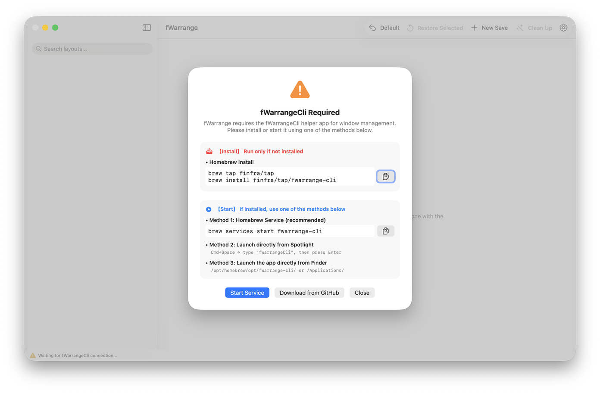
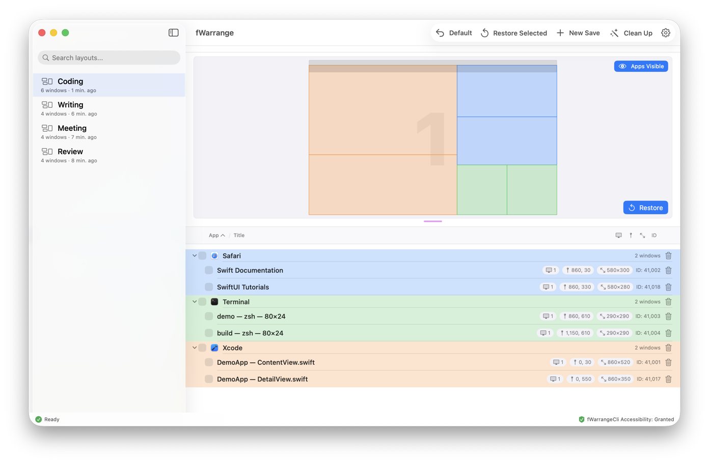
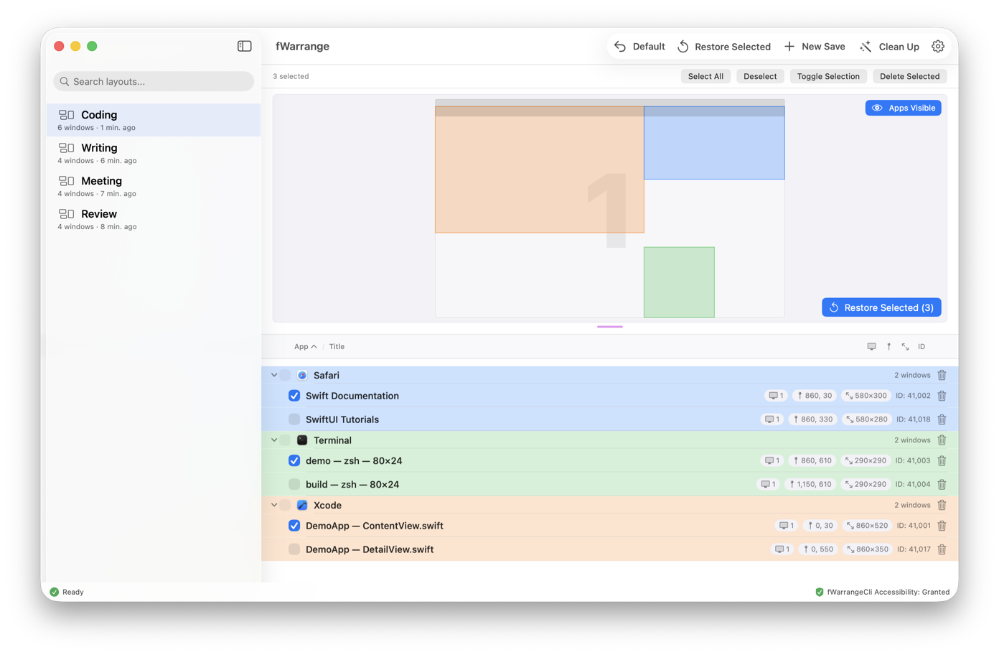
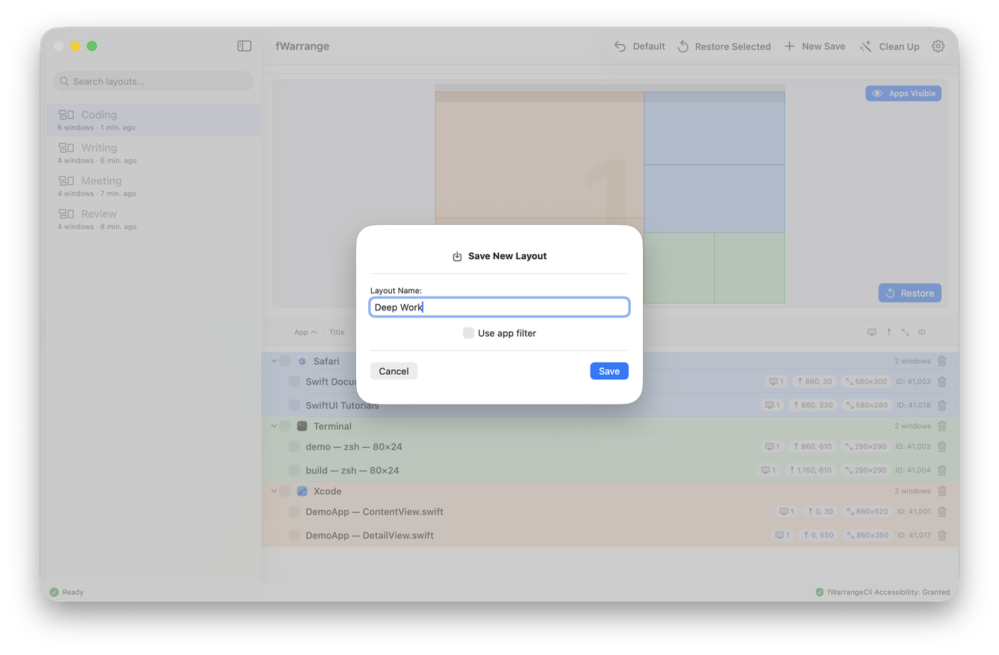
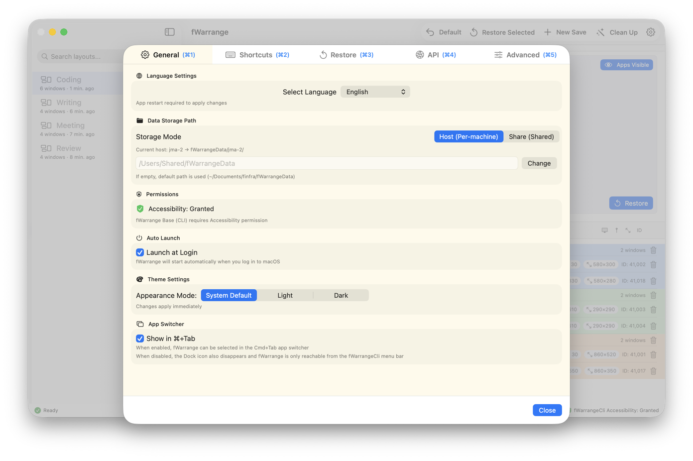
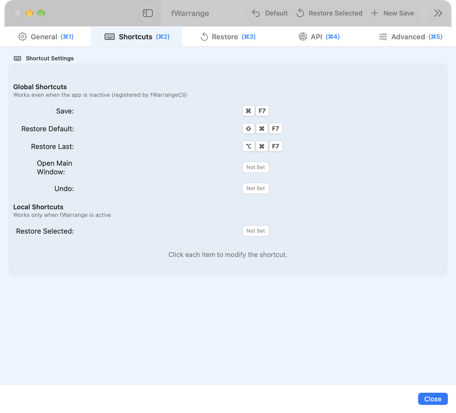
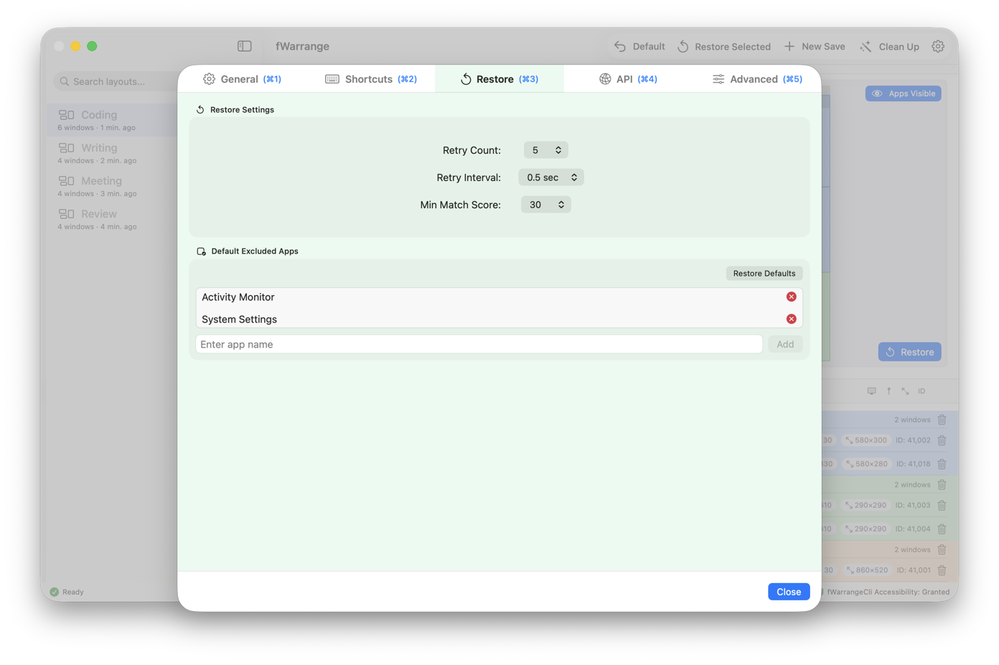
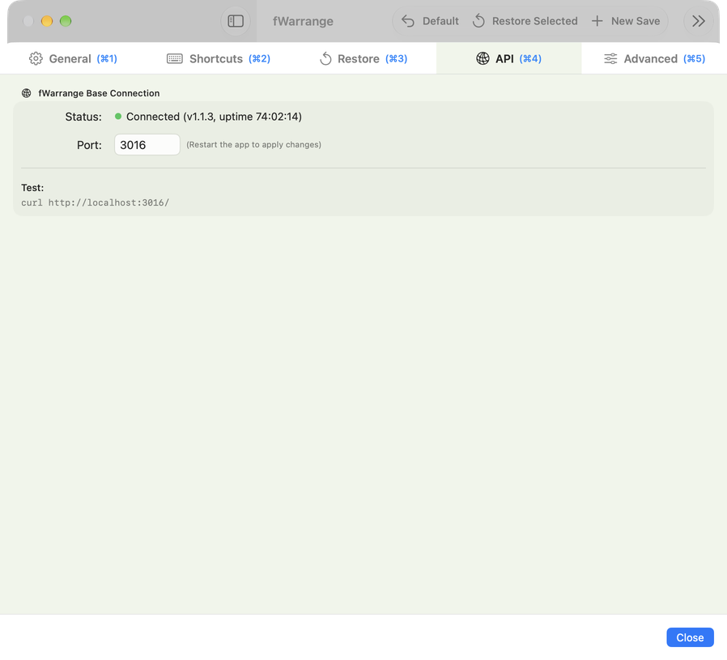
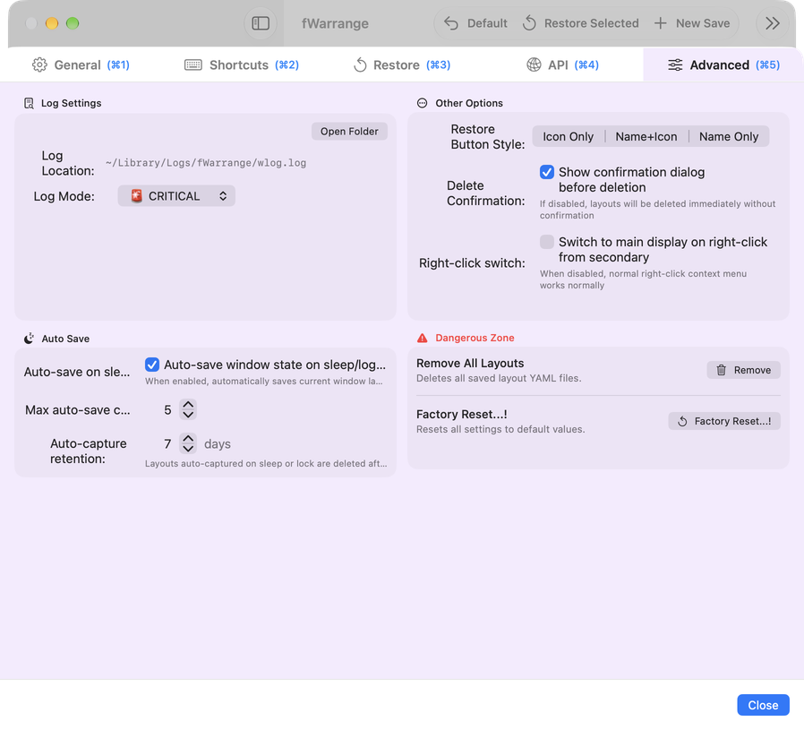

# GUI Usage

fWarrange is a macOS app for saving and restoring window layouts. The actual window capture and restore is performed by the free helper app **fWarrangeCli**; fWarrange provides the main window that shows and controls the results. The menu bar icon belongs to fWarrangeCli.

> The screenshots below were taken with fWarrange 1.1.3 (English UI).

## Helper Connection (fWarrangeCli)

If fWarrangeCli is not installed or not running when you launch fWarrange, a guide sheet appears.

| Section            | Content                                                                                       |
| ------------------ | --------------------------------------------------------------------------------------------- |
| 【Install】        | Run only if not installed — `brew tap finfra/tap` · `brew install finfra/tap/fwarrange-cli`   |
| 【Start】 Method 1 | Start as a Homebrew service (recommended) — `brew services start fwarrange-cli`               |
| 【Start】 Method 2 | Spotlight (⌘Space) → type `fWarrangeCli`, then press Enter                                    |
| 【Start】 Method 3 | Launch the app directly in Finder from `/opt/homebrew/opt/fwarrange-cli/` or `/Applications/` |
| Buttons            | **Start Service** · **Download from GitHub** · **Close**                                      |

Until the connection is established, the status bar shows `Waiting for fWarrangeCli connection...`. Once connected, the right side of the status bar shows fWarrangeCli's Accessibility permission status.

## Main Screen

| Area        | Description                                                                                                                                                 |
| ----------- | ----------------------------------------------------------------------------------------------------------------------------------------------------------- |
| Sidebar     | Saved layouts (name · window count · saved time) and a search field                                                                                         |
| Minimap     | Window arrangement of the selected layout, per display. **Apps Visible** (top right) toggles window display; **Restore** (bottom right) restores the layout |
| Window list | Windows grouped by app — display number · position · size · window ID. The trash icon removes a window from the layout                                      |
| Status bar  | Operation status and fWarrangeCli permission status                                                                                                         |

### Toolbar

| Button               | Action                                                                                      |
| -------------------- | ------------------------------------------------------------------------------------------- |
| **Default**          | Restore the default layout (disabled until a default layout is set)                         |
| **Restore Selected** | Restore the selected layout — if windows are checked in the window list, only those windows |
| **New Save**         | Save the current window arrangement as a new layout                                         |
| **Clean Up**         | Delete all layouts except the selected, last, and default ones (enabled with 4+ layouts)    |
| ⚙️ (Settings)         | Open the settings window (⌘,)                                                               |

The toolbar button style (Icon Only · Name+Icon · Name Only) can be changed in Settings › Advanced.

### Layout List Menu

Right-click a layout to open its menu.

* **Restore** · **Set as Default Layout** · **Rename** · **Delete**
* Select multiple layouts with ⌘-click (individual) or ⇧-click (range), then use **Restore selected (N) · Delete selected (N) · Deselect** to act on them at once

### Selective Restore

Check only the windows you want in the window list and click **Restore Selected** — only the checked windows return to their saved positions. The button shows the number of selected windows.

### Saving a New Layout

Clicking **New Save** opens the save sheet. The name is pre-filled with a date-based name. Turn on **Use app filter** to choose which apps to include and save only their windows.

## Settings (5 Tabs)

Open the settings window with the ⚙️ toolbar button or ⌘,. Jump to a tab directly with ⌘1 – ⌘5. Settings are stored in the fWarrangeCli configuration file `~/Documents/finfra/fWarrangeData/_config.yml`.

### Tab 1: General

| Item            | Default            | Description                                                                                                             |
| --------------- | ------------------ | ----------------------------------------------------------------------------------------------------------------------- |
| Select Language | System             | App display language; applied after restarting the app                                                                  |
| Storage Mode    | Host (Per-machine) | **Host**: each Mac saves to its own subfolder (`fWarrangeData/<hostname>/`) · **Share**: multiple Macs share one folder |
| Data path       | (empty)            | Choose a folder with **Change**. If empty, `~/Documents/finfra/fWarrangeData` is used                                   |
| Permissions     | -                  | fWarrangeCli's Accessibility permission status                                                                          |
| Launch at Login | On                 | Start fWarrange automatically when you log in to macOS                                                                  |
| Appearance Mode | System Default     | System Default / Light / Dark — applied immediately                                                                     |
| Show in ⌘+Tab   | On                 | When off, fWarrange disappears from the ⌘Tab switcher and the Dock and is reachable only from the fWarrangeCli menu bar |

### Tab 2: Shortcuts

Click an item to change its shortcut. **Global shortcuts** are registered by fWarrangeCli and work even when fWarrange is inactive; **local shortcuts** work only while the fWarrange window is active.

| Scope  | Function         | Default | Description                                               |
| ------ | ---------------- | ------- | --------------------------------------------------------- |
| Global | Save             | ⌘F7     | Save the current window arrangement                       |
| Global | Restore Default  | ⇧⌘F7    | Restore the default layout                                |
| Global | Restore Last     | ⌥⌘F7    | Restore the most recently used layout                     |
| Global | Open Main Window | ⌃⇧⌘F7   | Show the fWarrange main window                            |
| Global | Undo             | Not set | Return windows to the state before the last rearrangement |
| Local  | Restore Selected | Not set | Same as the Restore Selected toolbar button               |

> In the screenshot, Open Main Window has been cleared. Removing a line from `_config.yml` unregisters that shortcut.

### Tab 3: Restore

| Item                  | Default                           | Description                                                                                             |
| --------------------- | --------------------------------- | ------------------------------------------------------------------------------------------------------- |
| Retry Count           | 5                                 | Maximum retries when a window move cannot be verified                                                   |
| Retry Interval        | 0.5 sec                           | Wait time between retries                                                                               |
| Min Match Score       | 30                                | Window matches below this score are ignored                                                             |
| Default Excluded Apps | Activity Monitor, System Settings | Apps excluded from capture/restore. Type a name and click **Add**; **Restore Defaults** resets the list |

Window match scores: window ID match 100 · exact title 90 · regex 80 · contains 70 · size/ratio/area similarity 60–30.

### Tab 4: API

| Item   | Default | Description                                               |
| ------ | ------- | --------------------------------------------------------- |
| Status | -       | fWarrangeCli connection status · version · uptime         |
| Port   | 3016    | REST API listening port; applied after restarting the app |
| Test   | -       | Check command `curl http://localhost:3016/`               |

The REST server is built into fWarrangeCli and is **enabled by default**. Turning the server off, allowing external access, and the allowed IP range are set in `_config.yml`, not in the GUI.

| `_config.yml` key     | Default          | Description                          |
| --------------------- | ---------------- | ------------------------------------ |
| `restServerEnabled`   | `true`           | Enable the REST API server           |
| `allowExternalAccess` | `false`          | Allow access from LAN, etc.          |
| `allowedCIDR`         | `192.168.0.0/16` | IP range allowed for external access |

### Tab 5: Advanced

| Section        | Item                           | Default   | Description                                                            |
| -------------- | ------------------------------ | --------- | ---------------------------------------------------------------------- |
| Log Settings   | Log Location · **Open Folder** | -         | `~/Library/Logs/fWarrange/wlog.log`                                    |
| Log Settings   | Log Mode                       | CRITICAL  | Minimum log level to record                                            |
| Other Options  | Restore Button Style           | Name+Icon | Toolbar button display — Icon Only / Name+Icon / Name Only             |
| Other Options  | Delete Confirmation            | On        | Show a confirmation dialog before deleting or cleaning up layouts      |
| Other Options  | Right-click switch             | Off       | Switch to the main display on right-click from a secondary display     |
| Auto Save      | Auto-save on sleep             | On        | Automatically save the current window state on sleep/logout            |
| Auto Save      | Max auto-save count            | 5         | Maximum number of auto-saved layouts to keep                           |
| Auto Save      | Auto-capture retention         | 7 days    | Auto-captured layouts are deleted after this period (0 = keep forever) |
| Dangerous Zone | Remove All Layouts             | -         | Delete all saved layout YAML files                                     |
| Dangerous Zone | Factory Reset                  | -         | Reset all settings to their default values                             |

## Typical Usage Flow

1. Arrange your windows the way you want
2. Save the arrangement with **New Save** (or ⌘F7)
3. When needed, pick a layout in the sidebar and restore it with **Restore** (or a shortcut)
4. For a layout you use often, right-click › **Set as Default Layout**, then restore it instantly with **Default** (⇧⌘F7)

## Next Steps

* [REST API Usage](05_API_Usage.md)
* [Skill Usage](06_Skill_Usage.md)
* [MCP Server Usage](07_MCP_Usage.md)
