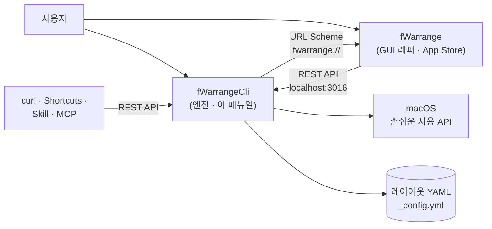

# fWarrangeCli 란?

fWarrangeCli 는 macOS 의 창 위치·크기를 저장하고, 한 번의 조작으로 되돌려 놓는 **창 레이아웃 엔진**입니다. 메뉴바에 상주하며 전역 단축키·REST API·명령행으로 동작합니다. Homebrew 로 배포되는 무료 · 오픈소스(Apache-2.0) 앱입니다.

다중 모니터 환경이나 목적별(개발·회의·디자인) 작업에서 흩어진 창을 매번 다시 배치할 필요 없이, 저장해 둔 배치를 즉시 복원합니다.

# fWarrangeCli 와 fWarrange (GUI 래퍼)

> **fWarrange(App Store 유료 앱)는 fWarrangeCli 의 GUI 래퍼입니다.**
> fWarrange 는 창을 직접 다루지 않고 fWarrangeCli 의 REST API(`localhost:3016`)를 호출해 레이아웃 목록·미니맵·설정 창을 보여 줍니다. 그래서 fWarrange 는 fWarrangeCli 없이는 동작하지 않고, fWarrangeCli 는 fWarrange 없이도 모든 핵심 기능이 동작합니다.

| 구분   | fWarrangeCli (이 매뉴얼)                                                   | fWarrange                                               |
| ------ | -------------------------------------------------------------------------- | ------------------------------------------------------- |
| 역할   | 엔진(헬퍼 데몬)                                                            | GUI 래퍼                                                |
| 배포   | Homebrew (무료 · 오픈소스)                                                 | App Store (유료)                                        |
| 화면   | 메뉴바 아이콘과 메뉴                                                       | 메인 창(레이아웃 목록 · 미니맵 · 창 목록) · 설정 창 5탭 |
| 기능   | 창 캡처·복원 · YAML 저장 · 전역 단축키 · REST API · 명령행 · `_config.yml` | 레이아웃 보기·선택 복원·이름 변경·삭제 · 설정 GUI 편집  |
| 매뉴얼 | 이 문서                                                                    | [fWarrange 안내 페이지](https://finfra.kr/product/fWarrange/kr/index.html)                         |

메뉴바의 **메인 창 열기** · **환경설정…** 은 fWarrange 를 여는 메뉴입니다. fWarrange 가 설치되어 있지 않으면 App Store 안내가 나타납니다.

# 핵심 기능

| 기능              | 설명                                                                 |
| ----------------- | -------------------------------------------------------------------- |
| 레이아웃 캡처     | CoreGraphics + 손쉬운 사용 API 로 모든 창의 위치·크기를 YAML 로 저장 |
| 스마트 복원       | 점수 기반 매칭으로 창 ID 가 바뀌어도 맞는 창을 찾아 복원             |
| 다중 레이아웃     | 목적별 레이아웃 여러 개 · 기본 레이아웃 지정                         |
| 다중 모니터       | 보조 모니터를 포함한 전체 디스플레이 지원                            |
| 전역 단축키       | 저장·기본 복원·최근 복원·되돌리기 (앱이 비활성이어도 동작)           |
| 자동 저장         | 슬립·로그아웃 시 현재 배치를 자동 저장                               |
| REST API          | `localhost:3016/api/v2` — curl · Apple Shortcuts · 스크립트 연동     |
| Claude Code Skill | AI 에이전트에서 자연어로 레이아웃 관리                               |
| MCP 서버          | Claude Desktop 등 AI 도구에서 도구(Tool)로 호출                      |

창 매칭 점수: 창 ID 일치 100 · 제목 완전 일치 90 · 정규식 80 · 포함 70 · 크기·비율·면적 유사도 60~30. 최소 점수(기본 30) 미만은 무시합니다.

# 사용 방법 4가지

1. **메뉴바 · 전역 단축키** — [메뉴바 사용법](04_MenuBar_Usage.md)
2. **명령행** — `fWarrangeCli status|list|capture|restore …` ([메뉴바 사용법 › 명령행](04_MenuBar_Usage.md#명령행-cli))
3. **REST API** — [REST API 사용법](05_API_Usage.md)
4. **AI 연동** — [Claude Code Skill](06_Skill_Usage.md) · [MCP 서버](07_MCP_Usage.md)

GUI 로 다루고 싶으면 래퍼 앱 fWarrange 를 함께 설치합니다 — [fWarrange 안내 페이지](https://finfra.kr/product/fWarrange/kr/index.html).

# 데이터 위치

| 항목          | 경로                                                                   |
| ------------- | ---------------------------------------------------------------------- |
| 설정 파일     | `~/Documents/finfra/fWarrangeData/_config.yml`                         |
| 레이아웃 YAML | `~/Documents/finfra/fWarrangeData/<호스트명>/*.yml` (`host` 모드 기본) |
| 로그          | `~/Documents/finfra/fWarrangeData/logs/wlog_cliApp.log`                |

# 다음 단계

* [설치 및 권한 설정](02_Install.md)
* [빠른 시작](03_QuickStart.md)
